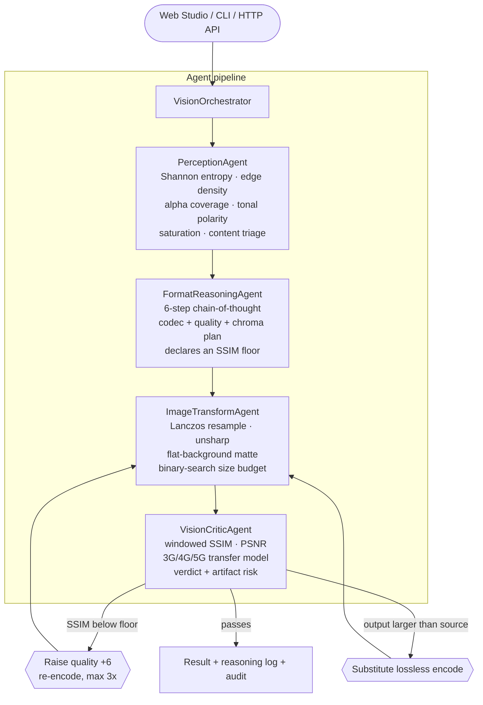

# AgenticVision Studio

**A multi-agent image optimisation pipeline whose auditor can reject its own output.**

[](https://github.com/asadullah48/agentic-vision-studio/actions/workflows/ci.yml)
[](https://www.python.org/downloads/)
[](https://fastapi.tiangolo.com/)
[](https://react.dev/)
[](#testing)
[](LICENSE)

Most image converters are a thin wrapper over an encoder call: you pick a format
and a quality number, and whatever comes out is what you get. AgenticVision
Studio instead runs four cooperating agents — one **measures** the image, one
**plans** an encode and explains its reasoning, one **executes** it, and one
**audits** the decoded result against the original.

The fourth agent is the point. It has veto power.

---

## What makes this a pipeline rather than a function call

Two feedback loops separate this from a settings form.

**1. The critic can reject the transformer's work.**
Every strategy profile declares an `ssim_floor`. After encoding, the critic
measures the *decoded output* against the source; if structural fidelity lands
below that floor, the orchestrator raises quality by 6 points and re-encodes,
up to three times. Without this loop the critic would be a reporter. With it,
the system detects and repairs its own bad encodes before a user sees them.

> In the benchmark below, `photo_grain.png` triggers exactly this: three critic
> retries before the encode clears its floor.

**2. A size-regression guard.**
A lossy encode of already-optimised content can come out *larger* than the
source — a real failure mode for flat-palette PNGs like logos and UI captures.
The orchestrator compares output to input and substitutes a lossless encode
when the lossy plan would have made things worse, flagging
`size_regression_avoided` on the response.

Both behaviours are covered by tests, not just asserted here.

---

## Architecture



### The agents

| Agent | Responsibility | Notable detail |
|:--|:--|:--|
| `PerceptionAgent` | Measures the image and classifies its content | Distinguishes documents from branded UI using **tonal polarity + saturation**, not just entropy — an achromatic bimodal image is a scan; a low-saturation one is an interface |
| `FormatReasoningAgent` | Picks codec, quality, chroma subsampling; emits a readable chain-of-thought | Quality figures track each codec's rate–distortion knee (WebP holds ~0.95 SSIM down to roughly q75 on photographic content, then degrades quickly), not round numbers |
| `ImageTransformAgent` | The only side-effecting stage — resample, matte, sharpen, encode | Byte-in/byte-out, never touches disk. A `--max-kb` budget is met by **binary-searching quality** |
| `VisionCriticAgent` | Audits the decoded output and issues a verdict | SSIM is computed over overlapping 11×11 Gaussian windows per Wang et al. (2004) — a global statistic reports ~0.99 for images with visible blocking, which would silently disable the critic that depends on it |

---

## Measured results

These are not target figures. They are the output of
`python -m app.cli benchmark`, committed as `benchmark_web.csv` and
`benchmark_auto.csv`, and **regenerated by CI on every push** so a change that
moves them shows up as a diff.

The corpus is synthesised from a fixed seed by
[`scripts/make_test_corpus.py`](scripts/make_test_corpus.py) — identical bytes
on every machine. The photographic sample deliberately carries film grain,
because a noiseless gradient compresses far better than any real photo and
would flatter the results.

### `--intent web_speed`

| Source | Output | Payload | SSIM | PSNR | Critic retries |
|:--|:--|--:|--:|--:|--:|
| `ui_dashboard.png` (3.05 KB) | WEBP 0.39 KB | **−87.3%** | 1.0000 | lossless | 0 |
| `document_scan.png` (5.49 KB) | WEBP 0.80 KB | **−85.4%** | 1.0000 | lossless | 0 |
| `photo_grain.png` (1201.02 KB) | WEBP 400.40 KB | **−66.7%** | 0.9462 | 28.32 dB | 3 |
| `logo_transparent.png` (2.90 KB) | WEBP 1.21 KB | **−58.5%** | 1.0000 | lossless | 0 |

Median saving **85.4%**, median SSIM **1.0000**, n = 4.

`PSNR = 100.0` in the CSVs is a reporting **ceiling**, not a measurement:
identical inputs give infinite PSNR, so `PSNR_CEILING_DB` stands in for
"mathematically lossless".

### Reproduce it

```bash
python scripts/make_test_corpus.py
python -m app.cli benchmark assets/benchmark --intent web_speed --csv benchmark_web.csv
```

### Strategy profiles

| Intent | Codec | Quality | Chroma | SSIM floor | Suited to |
|:--|:--|:--:|:--:|:--:|:--|
| `web_speed` *(default)* | WEBP lossy | 80–84, set from source weight | 4:2:0 | 0.94 | Hero images, landing pages, LCP work |
| `e_commerce` | WEBP lossy | 88 (90 with alpha) | 4:4:4 with alpha, else 4:2:0 | 0.96 | Product shots judged at full zoom |
| `ultra_compact_mobile` | WEBP lossy | 70 + unsharp | 4:2:0 | 0.90 | Bandwidth-bound mobile feeds |
| `lossless_archive` | PNG (WEBP with alpha) | lossless | 4:4:4 | 1.00 | Masters, re-editable sources |
| `print_ready` | TIFF, deflate | lossless | 4:4:4 | 1.00 | Prepress handoff |
| `auto` | inferred by the perception agent | — | — | — | When you would rather not choose |

---

## Quick start

**Prerequisites:** Python 3.10+ (developed on 3.14; CI covers 3.10 and 3.12)
and Node.js 18+ for the web UI.

```bash
git clone https://github.com/asadullah48/agentic-vision-studio.git
cd agentic-vision-studio
pip install -e ".[dev]"       # or: pip install -r requirements.txt
```

### Backend

```bash
python -m uvicorn app.main:app --host 127.0.0.1 --port 8000 --reload
```

Interactive API docs: <http://127.0.0.1:8000/docs>

### Web Studio

```bash
cd frontend
npm install
npm run dev
```

Open <http://localhost:5173>. Vite proxies `/api` to port 8000, so start the
backend first.

### CLI

```bash
# Optimise one image, printing the reasoning log and the critic's audit
python -m app.cli convert assets/benchmark/photo_grain.png --intent web_speed

# Hold the output under a hard size budget (binary-searches quality)
python -m app.cli convert photo.jpg --max-kb 120

# Benchmark a whole directory to CSV
python -m app.cli benchmark assets/benchmark --intent auto --csv results.csv

# Print the converter comparison table
python -m app.cli market
```

`convert` flags: `--intent`, `--format`, `--quality`, `--upscale {1,2,4}`,
`--max-kb`, `--remove-bg`, `--sharpen`, `--out`.

---

## HTTP API

The API is **stateless by design**: an upload is analysed in memory and the
encoded result comes back inline as a data URI. No server-side session holds a
half-processed image, no user-controlled path is ever joined onto a directory,
and the same code runs unchanged on a read-only serverless filesystem.

| Method | Route | Purpose |
|:--|:--|:--|
| `GET` | `/api/health` | Service status, upload cap, and whether an LLM is reachable |
| `POST` | `/api/analyze` | Perception agent only — cheap telemetry on upload, before any settings are chosen |
| `POST` | `/api/pipeline` | Full four-agent run; returns perception, reasoning, transform, audit, and the image |
| `POST` | `/api/chat` | Natural-language request → parsed parameters → executed pipeline |
| `GET` | `/api/market-intelligence/tools` | Converter comparison dataset |
| `GET` | `/api/market-intelligence/faqs` | Technical FAQ entries |
| `POST` | `/api/market-intelligence/recommend` | Multi-criteria converter recommendation |

`/api/pipeline` accepts multipart form fields: `intent`, `target_format`,
`quality` (10–100), `upscale` (1–4), `remove_bg`, `sharpen`,
`normalize_contrast`, `target_size_kb`.

### Input guardrails

Uploads are capped at 12 MB and 40 megapixels — the pixel ceiling bounds memory
use and blocks decompression bombs. Unusable input returns a `400` with a
readable message rather than an opaque `500`.

---

## Configuration

Every setting is environment-driven with an `AVS_` prefix, and all have working
defaults. Copy [`.env.example`](.env.example) to `.env` to override.

| Variable | Default | Notes |
|:--|:--|:--|
| `AVS_MAX_UPLOAD_SIZE_MB` | `12` | Rejects larger uploads |
| `AVS_MAX_PIXELS` | `40000000` | Decompression-bomb ceiling |
| `AVS_CORS_ALLOW_ORIGINS` | `*` | Comma-separated; fine for an unauthenticated demo |
| `AVS_LLM_ENABLED` | `true` | See below |
| `AVS_LLM_BASE_URL` | `http://127.0.0.1:11434/v1` | Any OpenAI-compatible endpoint |
| `AVS_LLM_MODEL` | `llama3.2` | |
| `AVS_LLM_TIMEOUT_SECONDS` | `10` | Short on purpose — a slow model must not hold an HTTP request open |
| `AVS_WORKSPACE_DIR` | repo dir, else OS temp | CLI output only; the API keeps everything in memory |

### The optional LLM, and why it is not in charge

`/api/chat` parses free-form requests ("shrink this for mobile but keep the
logo crisp"). An LLM helps with fuzzy objectives — *"archive this scan"* →
`lossless_archive` — but makes a poor codec engineer: in testing, a 3B model
answered *"make it tiny"* with **SVG**, which would have *increased* the
payload.

So parsing is a hybrid. Literal extractions (a format the user actually named,
a number they actually typed) come from regexes; the objective comes from the
model when one is reachable; and the deterministic reasoning agent keeps final
authority over format and quality.

**No model is required.** With nothing running, the rule-based parser handles
requests and `/api/health` reports `llm_reachable: false`. That is the
configuration CI runs and the one a public deployment uses. To enable it
locally:

```bash
ollama pull llama3.2 && ollama serve
```

---

## Testing

```bash
python -m pytest tests/ -q
```

**107 tests passing.** Coverage is gated at 85% in CI. The suite uses in-memory
fixtures for every content category — no disk fixtures, no network.

CI runs three jobs on every push: the backend suite against Python 3.10 and
3.12 with `ruff` linting, a frontend production build, and a benchmark job that
regenerates the corpus and re-measures the numbers published above.

---

## Project layout

```
app/
  agents/        perception · reasoner · transformer · critic · orchestrator
  core/          config (pydantic-settings) · imaging (validation) · metrics (PSNR/SSIM)
  services/      llm (optional, degrades gracefully) · market_intel
  main.py        FastAPI surface
  cli.py         convert · benchmark · market
frontend/src/    React 18 Studio — diff slider, perception HUD, reasoning terminal
scripts/         seeded benchmark-corpus generator
tests/           107 tests
```

---

## Honest limitations

Worth stating plainly, because the code says the same thing:

- **The upscaler is not AI.** `--upscale` is Lanczos resampling followed by an
  unsharp mask — high-quality classical interpolation. It cannot invent detail
  absent from the source, and it is labelled that way throughout the codebase.
- **Background removal is a flat-background matte,** not a learned segmentation
  model. It works on product shots against uniform backdrops and will not
  handle hair or foliage.
- **The benchmark corpus is synthetic.** Real photographs cannot be committed
  (licensing, weight), so the corpus is seeded and reproducible instead. Run
  `benchmark` against your own directory for numbers that reflect your content.
- **AVIF support depends on your Pillow build.** Where the encoder is
  unavailable the pipeline falls back rather than failing.

---

## Engineering notes

Decisions made deliberately here, with the reasoning, in case they are useful:

- **SSIM is computed locally, not globally.** The first implementation folded a
  single mean and variance into one number. Structural similarity is defined
  over overlapping windows; the global version reported ~0.99 for images with
  plainly visible blocking, which would have silently disabled the critic that
  depends on it. Implemented on NumPy alone — no SciPy or scikit-image — to
  keep the deployment bundle small.
- **Agents pass bytes, not paths.** This removes server-side state, makes every
  agent unit-testable without a filesystem, and is what allows serverless
  deployment.
- **CORS credentials stay off.** A wildcard origin combined with credentialed
  requests is invalid per the CORS spec, and the API is unauthenticated anyway.
- **Form-field bounds live on the FastAPI parameter,** not in the function body,
  so a bad value becomes a `422` instead of letting a `ValidationError` escape a
  dependency as a `500`.

---

## What this project demonstrates

Built as a working reference for agentic system design. The transferable ideas:

- **An evaluator with authority over the executor.** A critic that only reports
  is decoration; the value appears when it can reject work and force a retry
  against a declared threshold — and when the retry budget is bounded, so
  failure degrades into an honest `met_quality_floor: false` rather than a loop.
- **Deterministic authority over probabilistic input.** The LLM classifies
  intent; it never selects a codec. Falling back to rules is the default path,
  not the error path.
- **Claims that are reproducible.** Every number in this README is regenerated
  by CI from a seeded corpus, so documentation drift shows up as a visible diff.
- **Guardrails as design.** Pixel ceilings, stateless request handling, no
  user-controlled paths, and bounded retries — each closing a specific failure
  mode rather than added generically.

---

## Author

Built by **Asadullah Shafique**.

🔗 Explore my portfolio showcasing Agentic AI projects and real-world applications: **[asadullahshafique-devunity.vercel.app](https://asadullahshafique-devunity.vercel.app)**

---

## License

MIT — see [LICENSE](LICENSE).
