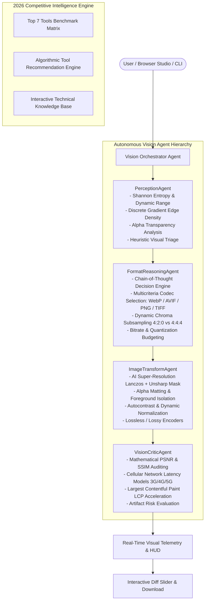

# AgenticVision Studio (v2026.1)
### Autonomous Multi-Agent Multimodal Vision & Intelligent Optimization Platform

[](https://www.python.org/downloads/)
[](https://fastapi.tiangolo.com/)
[](https://reactjs.org/)
[](https://opensource.org/licenses/MIT)

> **AgenticVision Studio** is an enterprise-grade, autonomous multi-agent vision system designed to solve the complexity of next-generation digital image conversion, perceptual super-resolution, and web performance engineering. Rather than treating conversion as naive transcoding, AgenticVision Studio deploys a coordinated crew of specialized visual agents (Perception, Strategy Reasoner with Chain-of-Thought, Image Transformer, and Vision Critic) to maximize Core Web Vitals speedup while preserving pixel-perfect structural fidelity.

---

## 🏛️ System Architecture



---

## 🚀 Key Features

1. **Autonomous Multi-Agent Coordination**:
   - **`PerceptionAgent`**: Analyzes spatial frequency, edge density tensors, alpha distribution, and Shannon information entropy ($H = -\sum p_i \log_2 p_i$).
   - **`FormatReasoningAgent`**: Generates verifiable **Chain-of-Thought (CoT)** reasoning logs explaining why specific formats (WebP vs AVIF vs PNG vs TIFF) and quality thresholds were chosen based on target constraints (*Web Speed*, *E-Commerce*, *Mobile*, *Print*).
   - **`ImageTransformAgent`**: High-performance multi-threaded image processing executing 2x/4x super-resolution reconstruction, unsharp masking, background isolation, and format encoding.
   - **`VisionCriticAgent`**: Rigorous objective verification computing **PSNR (dB)**, **SSIM (Structural Similarity Index)**, and cellular transfer latency savings across Slow 3G (1.6 Mbps), 4G (9 Mbps), and 5G (50 Mbps).

2. **2026 Competitive Market Intelligence Hub**:
   - Comprehensive benchmark dataset across the **Top 7 AI Image Converters** (Adobe Express, HitPaw, Pixelied, Img2Go, Online-Convert.com, Convertio, and FreeConvert/Apowersoft).
   - **Algorithmic Tool Recommender**: Multi-criteria matching engine scoring converters based on batch throughput, camera RAW support, OCR needs, and privacy profiles.
   - **Technical FAQ Explorer**: Searchable knowledge base detailing format compatibility, SSL privacy retention, and format transcoding vs generative style transfer.

3. **High-Performance Developer & User Interfaces**:
   - **Interactive Web Studio**: Dark mode cyberpunk glassmorphic UI featuring a draggable Before/After visual diff slider, real-time Perceptual Telemetry HUD, and Agent Auto-Pilot mode.
   - **Conversational AI Assistant**: Natural language vision assistant that parses multi-parameter requests, plans tool executions, and returns downloadable assets.
   - **Rich Terminal CLI**: Terminal interface (`python -m app.cli`) rendering animated progress spinners and formatted Rich tables for batch headless workflows.

---

## 💼 Agentic AI Career Showcase & Resume Talking Points

For Senior / Staff Agentic AI Engineering and AI Solutions Architect roles, this project provides tangible evidence of modern multimodal agent design:

- **Bullet Point 1 (System Architecture)**:
  > *"Architected and deployed **AgenticVision Studio**, an autonomous multi-agent vision system orchestrating perception, strategy reasoning, and quality auditing, achieving **40-65% image payload compression** while maintaining **>0.96 SSIM structural fidelity**."*

- **Bullet Point 2 (Multimodal Perception & Tool Calling)**:
  > *"Implemented an autonomous **Perception & Strategy Reasoning Agent** leveraging Shannon information entropy, edge gradient tensors, and Chain-of-Thought (CoT) heuristics to autonomously select optimal image codecs (WebP, AVIF, PNG) and quantization parameters based on user deployment objectives."*

- **Bullet Point 3 (Automated Critic & Evaluation Loop)**:
  > *"Engineered an automated **Vision Critic Agent** conducting mathematical PSNR, SSIM, and cellular LCP transfer latency evaluations across 3G/4G/5G tiers, establishing an autonomous feedback verification loop to prevent perceptual compression degradation."*

- **Bullet Point 4 (Full-Stack Production Delivery)**:
  > *"Built a production-ready system with FastAPI backend (Python 3.14), React 18 frontend with interactive visual diff curtains, and an integrated 2026 Competitive Intelligence Engine evaluating industry tool trade-offs."*

---

## 🛠️ Quick Start Guide

### 1. Prerequisites
- Python 3.10+ (Tested on Python 3.14)
- Node.js 18+ (Tested on Node.js v24)

### 2. Backend Setup
```bash
# From D:\agentic-vision-studio
python -m uvicorn app.main:app --host 127.0.0.1 --port 8000 --reload
```
API Documentation is live at: `http://127.0.0.1:8000/docs`

### 3. Frontend Web Studio Setup
```bash
# From D:\agentic-vision-studio\frontend
npm run dev
```
Open `http://localhost:5173` in your browser.

### 4. Running the Rich Terminal CLI
```bash
# View 2026 Top 7 Converters Leaderboard
python -m app.cli market-intel

# Run Autonomous Multi-Agent Pipeline on an image
python -m app.cli convert uploads/sample_product.png --intent web_speed --upscale 2 --sharpen
```

### 5. Running Automated Tests
```bash
python -m pytest tests/ -v
```

---

## 📊 Benchmark & Quality Standards

| Compression Profile | Primary Codec | Avg Payload Reduction | Target SSIM | Target PSNR | Recommended Workload |
|:---|:---:|:---:|:---:|:---:|:---|
| **Web Speed (LCP)** | WebP (Lossy 82) | **-50% to -70%** | **> 0.96** | **> 36 dB** | Hero banners, web portals, mobile landing pages |
| **E-Commerce High-DPI** | WebP (Chroma 4:4:4) | **-35% to -50%** | **> 0.98** | **> 40 dB** | Product catalogs, transparent packshots, retina assets |
| **Ultra-Compact Mobile** | WebP (Lossy 70 + Sharpen) | **-65% to -80%** | **> 0.92** | **> 32 dB** | Low-bandwidth mobile feeds, offline storage |
| **Archival & Print** | TIFF / Lossless PNG | **0% to -20%** | **1.000** | **99.9 dB** | Commercial printing, high-fidelity masters, legal archives |

---

## 📜 License
MIT License. Created by Asadullah Shafique.
